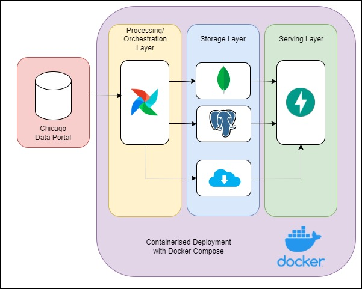
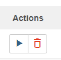
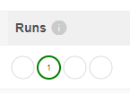

# chicago_taxi_data
A small POC Project to extract data from the Chicago Taxi Trips public data set and load it into SQL and a NoSQL Databases, exposing results via an API.

# Table of Contents
1. [Accessing the Repo](#repo_access)
2. [Project Overview](#overview)
3. [Running the Solution](#run_solution)
    1. [Start the Containers](#start_containers)
    2. [Log into Airflow](#airflow_login)
    3. [Run the Pipelines](#run_pipelines)
    4. [Accessing Results](#access_api)
    5. [API Summary](#api_summary)
    6. [Clean Up](#clean_up)

## Accessing the Repo <a name="repo_access"></a>
As it is configured to be private, to clone this repo you will need to share an ssh public key with me. I will then add this to the repo to allow access. 

Instructions on how to create new keys can be found [here](https://docs.github.com/en/authentication/connecting-to-github-with-ssh/generating-a-new-ssh-key-and-adding-it-to-the-ssh-agent)

With a new key created, copy the contents of the `<key-name>.pub` file to a text file and send it via email to liam.j.campbell@hotmail.co.uk

# Project Overview <a name="overview"></a>
This project implements the following Architecure:



The tools implemented in each layer are
- The Processing/ Orchestration layer
  - Airflow
- The Storage Layer
  - MongoDB
  - PSQL
  - Remote Storage via Docker Volume
- The Serving Layer
  - API built with FastAPI

The services for each layer are all built and managed by the `docker-compose.yaml` file found in the root of the repository.

In this file we define the following containers:
 - `airflow_meta_db`: Host for Airflow's PostgreSQL backend database
 - `airflow_scheduler`: Host for Airflow's Scheduler
 - `airflow_webserver`: Host for Airflow's Webserver
 - `postgres_db`: Host for the PSQL Database Service
 - `mongo_db`: Host for the Mongo Database Service
 - `app_server`: Host for the REST API

We also define 2 Docker managed volumes, one for airflow's logs, and one for the 'remote-storage' volume, which for the sake of this exercise will act as a proxy to cloud storage solutions.

Most images are simply based off of standard Docker base images. However, for the Airflow Schedular, Web Server, and the app_service API host, Dockerfiles have also been included to give a little more configuration where needed.

The Dockerfiles for these services can be found at:
 - airflow_scheduler: `docker/scheduler/Dockerfile`
 - airflow_webservice: `docker/web_server/Dockerfile`
 - app_server: `src/self_service_api/Dockerfile`

All code for the Airflow pipelines can be found in `src/pipelines/`:
 - `sql/` - Files containing SQL code for PSQL
 - `taxi_trips_etl_pipeline.py` - DAG Definition for main ETL Pipeline
 - `initialisation_pipeline.py` - DAG Definition for Initialisaiton Pipeline
 - `etl_tasks.py` - Airflow Task Definitions
 - `etl_functions.py` - extra functions for use in the ETL Tasks

Code for the self service API can be found in `src/self_service_api/`:
 - `src/main.py` - Main API definition and bulk export method
 - `src/mongo_database.py` - API for Querying summary statitics from mongoDB
  - `src/psql_database.py` - API for Querying summary statitics from PSQL
  - `src/psql_database.py` - API for Querying summary statitics

Initialisation scripts for each database can be found under  
- `data/psql/scripts`
- `data/mongo/scripts`

Unit tests for some of the functions in `src/pipelines/etl_functions.py` are available in `test/unit/test_etl_functions.py`. To run the tests, execute the `run_tests.sh` file from the root of the repo like so:

```bash
sh ./run_tests.sh
```

# Running the Solution <a name="run_solution"></a>
To run the solution and return some results from the API we must:
 - Start the containers
 - Run Initialisation Pipeline in Airflow
 - Run ETL Pipeline in Airflow
 - Make a call to the API

## Start the Containers <a name="start_containers"></a>
In order to start the containers for each service, with your terminal in the root directory of this repo, run the following command:

```bash
docker compose up
```

Adding the `-d` flag to this command will limit the output generated and force docker to run in the background

## Log into Airflow UI <a name="airflow_login"></a>
With the containers started, we can log into Airflow via the Web UI, available on start up at the following URL:

```
localhost:8080
```

It may take a minute for the Web UI to be fully up and running. 

For this PoC, the username and password for airflow are simply `admin`, though this should of course be changed in production.

## Run the Pipeines <a name="run_pipelines"></a>
In the Airflow UI, on the DAGs Page, you should be able to see a few pipelines, the primary ones we are concerned with are; 
- `initialisation_pipeline`
- `taxi_trips_etl_pipeline`.

First we must run the initialisation pipeline to ensure all necessary tables and databases have been created.

To start a pipeline, click the 'Play' button inline with the pipeline name, on the right hand side listed under 'Actions'



This pipeline should take a few seconds to run. When it completes, you should see a green circle in line with the pipeline name, under the heading 'Runs', Like so;



With this initialisation pipeline complete, we can now execute the Taxi Trips ETL Pipeline.

This pipeline can be configured to load data for any given month in a given year, or backfill from the given month to present. Without any additional configuration, the pipeline will simply load data for January 2023.

The ETL Pipeline, for a single month, typically takes around 5 minutes to run.

## Accessing Results <a name="access_api"></a>

With both the pipelines having successfully run, we can now make a call to the API to get results.

The main URL of the API is

```
localhost:9001
```

Here, there are a few endpoints we can use:

 - `localhost:9001` - baseline API for bulk dumps
 - `localhost:9001/api/psql` - PSQL API for analysing PSQL data
 - `localhost:9001/api/mongo` - Mongo API for Analysing Mongo data

Documentation about available methods for each end point can be found by appending `/docs` to the end of each URL above.

### API Summary <a name="api_summary"></a>
To bulk dump PSQL data:

```
localhost:9001/dump/psql/csv
```
or
```
localhost:9001/dump/psql/json
```

To bulk dump Mongo data:

```
localhost:9001/dump/mongo/csv
```
 or 
```
localhost:9001/dump/mongo/json
```

each of the URLs `/api/psql` and `/api/mongo` have a `company_summary` endpoint that can be accessed like so;

```
localhost:9001/api/psql/company_summary
```

This endpoint will return total fare and total number of trips per taxi company listed in the dataset.

## Clean Up <a name="clean_up"></a>
When you are done running the pipelines and accessing the APIs, the docker containers can be stopped by running the following command in the terminal;

```bash
docker compose down --volumes
```